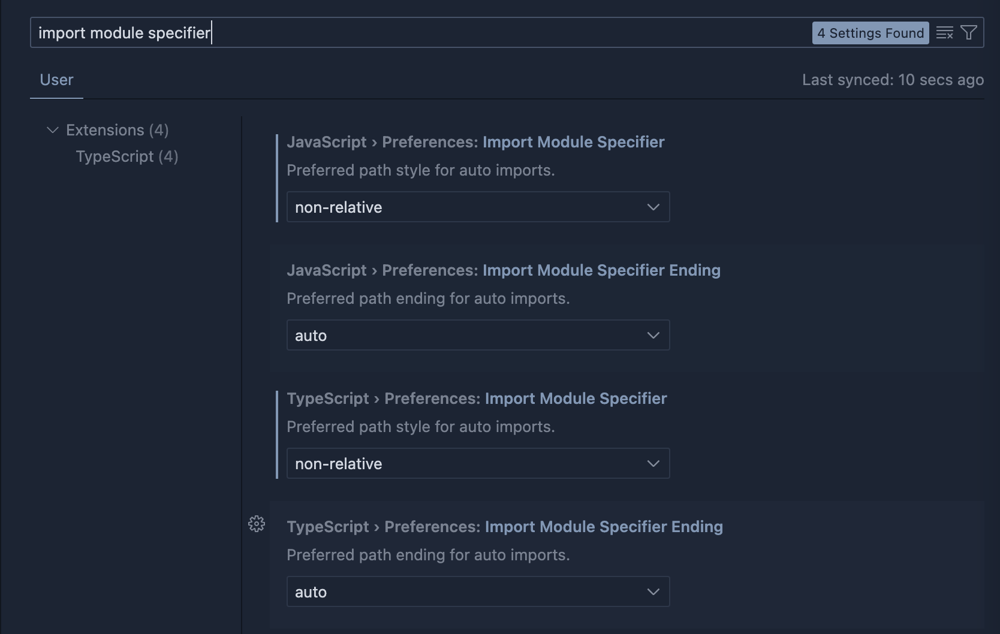

# tsconfig-paths-webpack-plugin kullanarak CRA'da typescript path alias yapılandırması

## tsconfig.json dosyasının yapılandırılması

baseUrl:Tüm modül yollarının başlayacağı temel dizini belirtir.
paths:Örnek olarak "@/" ile başlayan yolların src ve dist klasörleri altındaki dosyaları içerdiği anlamına gelir.

```
{
  "compilerOptions": {
    // existing options...

    "baseUrl": ".",
    "paths": {
      "@/*": ["./src/*", "./dist/*", ""],
      "pages/*": ["src/pages/*"],
      "components/*": ["src/components/*"],
      "types/*": ["src/@types/*"],
      "public/*": ["public/*"]
    }
  }
}
```

Otomatik olarak @/ yolu import edebilmek içinde vscode'da
"import module specifier" ayarlarını yapılandırmak gerekiyor.


## tsconfig-paths-webpack-plugin kurulumu

```bash
npm install tsconfig-paths-webpack-plugin --save-dev
```

1. node_modules/react-scripts/config/webpack.config.js dosyasını açın,
2. webpack.config.js dosyanızın en üstünde, TsconfigPathsPlugin'i başlatmak için require ifadesini ekleyin
3. Yapılandırma içinde çözümleme bölümünü bulun
4. resolve bölümünün plugins dizisini içerdiğinden emin olun.
5. plugins dizisine new TsconfigPathsPlugin() satırını ekleyin.
